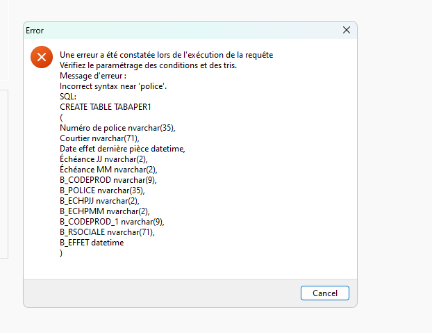

# Guide pour la création d'une requête Belair

## Lancer le créateur de requêtes de Belair
On peut lancer le créateur de requêtes à partir de Belair dans le menu Bureautique => Requêtes => Éditeur de requêtes.
On peut aussi éxécuter baireq.exe.

## Getting Started
1- Clicker le + pour créer une nouvelle requête. Dans ce tuto, je vais utiliser un exemple de requête pour les renouvellements auto

2- Clicker le menu Édition => Mode SQL <span style="color:green">//Aille on peut tu s'arrêter 2 secondes pour contempler que y'a 2 menu Édition. UI 100</span>

3- Dans le nouvel onglet <i>SQL</i>, décocher <i>Requête automatique</i> et puis clicker sur <i>Modifier requête</i>.

4- Coller la requête SQL que vous voulez afficher avec la requête. Pour cette exemple, moi j'utilise celle-ci :

```sql
SELECT pol.B_POLICE,  c.B_CONTRAT, p.B_PIECE
FROM CONTAMC c
INNER JOIN PIECEAMC p 
ON c.B_CONTRAT = p.B_CONTRAT AND c.B_DERPIECE = p.B_PIECE
INNER JOIN POLICAMC pol 
ON pol.B_CONTRAT = p.B_CONTRAT AND pol.B_PIECE = p.B_PIECE AND pol.B_CIE = p.B_CIEMAJ
WHERE B_ECHPJJ is not null AND B_ECHPMM is not null
    --La date d'échéance est dans les 60 jours
AND DATEADD(DAY, 60, GETDATE()) > [dbo].[NextDueDate](B_ECHPJJ, B_ECHPMM)
	--Le produit est un des notre
AND p.B_CODEPROD = 'LL_AUTO'
	--Tjrs en cours
AND p.B_SITPIECE IN ('1', 'W')
```

5- Clicker sur <i>Tester</i> pour s'assurer que la donnée est bonne et clicker sur <i>OK</i>.

Bon ... là avant de continuer, on va ce le dire tout de suite. Les trucs que vous avez dans le SELECT de votre requête ne sert à RIEN. RIEN!!! Vous allez voir.

6- Aller sur l'onglet <i>Exploitation</i> et cocher <i>Aperçu</i> et <i>Afficher la recherche à partir de l'aperçu</i>.

7- Aller sur le nouvel onglet <i>Aperçu sélection</i>

8- Clicker sur cet icône dans la marge en haut. Une nouvelle fenêtre va s'ouvrir.


9- Sur la nouvelle fenêtre, il faut reclicker sur le même icône dans la marge en haut (pas celle du milieu). Ça va ouvrir une autre fenêtre.

10- Dans cette fenêtre, c'est ici qu'on choisis le champs et le pivot. Pour mon exemple, je vais choisir de mettre le numéro de contrat dans mon résultat. J'ouvre donc le dossier Tiers et je click sur le dossier Cont.

11- Ajouter les champs qu'on veut dans <i>Information(s) retenue(s)</i>.

12 - Bla bla bla pas ltemps d'expliquer

?- Retourner sur <i>Exploitation</i> et clicker sur <i>Executer</i>. Et BOOM! Erreur!

Erreur- <b>The multi-part identifier 
"CONT.B_CONTRAT" could not be bound.</b>
<br>
Cette erreur est là parce que Belair s'attend à ce que vous utilisiez certains alias dans votre requête sql pour certaines tables. 
<br>
Exemple: CONTRAT => cont
<br>
Vous pouvez voir quel est le nom attendu dans aperçu sélection. Un des effets secondaires de cette "feature", c'est qu'on ne peut pas avoir deux fois la même table dans notre requête (donc adieu bureau de courtage + nom d'assuré). Anyway, il faut corriger la requête SQL.
<br>
Voici ma requête corrigée :
<br>
```sql
	SELECT poli.B_POLICE,  cont.B_CONTRAT, piec.B_PIECE
	FROM CONTAMC cont
	INNER JOIN PIECEAMC piec
	ON cont.B_CONTRAT = piec.B_CONTRAT AND cont.B_DERPIECE = piec.B_PIECE
	INNER JOIN POLICAMC poli
	ON poli.B_CONTRAT = piec.B_CONTRAT AND poli.B_PIECE = piec.B_PIECE AND poli.B_CIE = piec.B_CIEMAJ
	WHERE B_ECHPJJ is not null AND B_ECHPMM is not null
    --La date d'échéance est dans les 60 jours
	AND DATEADD(DAY, 60, GETDATE()) > [dbo].[NextDueDate](B_ECHPJJ, B_ECHPMM)
	--Le produit est un des notre
	AND piec.B_CODEPROD = 'LL_AUTO'
	--Tjrs en cours
	AND piec.B_SITPIECE IN ('1', 'W')
```

1? - Bla bla bla fini! (sorry bro pas l'temps)


## Restrictions

### PAS DEUX LIAISIONS SUR LA MÊME TABLE

### PAS DE COLONNE DE CHAMPS CALCULÉS
Ça fait que Belair gèle quand on click sur <i>Executer</i> (il faut le kill après).

## WHAT???

### L'ordre des colonnes dans ton SQL change l'ordre des colonnes dans ta requête si Belair les reconnait, sinon il prend le stock de contenu et le sacre à la fin.

### Belair créer une table de BD pour te montrer ta requête. La table est visible tant que tu laisses la requête ouverte. Lorsque la requête est fermée, la table est supprimée. J'ai réussi à avoir un message d'erreur lors de la création de la table lol.  


