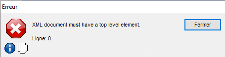

# Erreurs

## [Error] : Subroutine myFunction already declared
 Si vous êtes certain qu'il n'y a pas deux fonctions avec ce même nom, c'est probablement un problème avec vos imports. Vérifiez le <i>uses</i> de vos scripts, il faut que les imports pour une librairies utilisent la même casse (de caractère).

#### Exemple :
Le Script Ferme a les imports suivants :
```
 uses AnimauxDeFermeLib, AnimauxDomestiquesLib
```

La librairie AnimauxDeFermeLib a les imports suivants :
```
 uses VacheLib, PouletLib, MoutonLib, CHienLib 
```

La librairie AnimauxDomestiquesLib a les imports suivants :
```
 uses ChienLib, ChatLib, HamsterLib 
```

Vu que le nom pour la librairie ChienLib n'est pas écrite <b>exactement de la même façon</b> dans les imports des deux librairies (vu que l'une des deux a un H majuscule). Belair comprends CHienLib et ChienLib comme étant deux librairies différentes donc il la charge deux fois et les fonctions de ChienLib renvoient une erreur telle que : Subroutine ChasserLesEcureuils already declared.

## [Error] : Invalid IF/SI statement
 - Il manque un statement <i>then</i> après ta condition

# Erreurs Runtime
## [Error] : Could not convert variant of (Type) into (Type)
 - Le message est assez self-explanatory
 - Un truc à noter c'est que des fois, on peut avoir <b>Could not convert variant of (Null) into (OleStr)</b> alors qu'un string devrait pouvoir être null. Je ne suis pas trop sur de ce cas parce qu'avec un watch le TYPE de ma var est null.

## [Error] : (Code 400) No automate on this base
 - Il faut que le service BaiimpPool soit démarré (et préférablement configuré avec la bonne config).

## [Error] (BasError) : Votre serveur d'application n'est pas démarré.
 - Le BAS est down. Il faut le redémarrer. 

## [Error] (BasError) : No license for BAS Module

## [Error] : Access violation at address 00EFBF23 in module 'BSEDev.exe'. Read of 00000004
 - Note importante : Cette erreur est CHIANTE! Elle rend le déboguage un enfer.
 - Si une variable contient un objet ou un tableau, il devient impossible de mettre des variables espions pour en visionner le contenu.
 - Cette erreur n'apparait pas s'il n'y a pas de breakpoint lors du déboguage (sauf que tu ne peux pas plus visionner le contenu de la variable).
 - Si tu as un espion sur une variable, que tu avances ligne-par-ligne et que cette variable reçoit son contenu, cette erreur apparait et fait planter l'éxécution de ton script IMMÉDIATEMENT. Celà outrepasse les redirections d'erreur (donc try/catch).
#### Counterplay
 - Si tu n'as pas un espion sur une variable, que tu avances ligne-par-ligne et que cette variable reçoit son contenu, tu peux alors essayer de mettre un watch sur la variable pour voir si c'est "safe". Si le contenu ne peut pas être lu, l'erreur se produit MAIS N'ARRÊTE PAS L'ÉXÉCUTION (comme expliqué plus haut) tant que tu ne continues pas le programme (avec F7/F8/Éxécuter). Si l'erreur ce produit, tu peux enlever l'espion avant de continuer l'éxécution. Cela te permet de "Peek" une variable pour savoir si elle est "safe" à regarder. 
 - Utiliser print(dumpvar(myVar)), sauf qu'il faut y penser AVANT l'éxécution.
 - Les propriétés des objets peuvent être visionnées individuellement. Ex: ma variable Cont contient un contrat (que je ne peux pas visionner), je peux mettre un espion sur Cont.contrat pour voir sa clé primaire. Cela est bonne alternative (bien que lente) pour lire le contenu mais elle requiert la connaissance des propriétés de la variable.
#### Autres
  - Cette erreur est un bug apparu sur la version 4.2I. Nous avons nous-même signalé l'erreur et Belair a ouvert un ticket.
  - Un message de cette erreur apparait des fois lors de la suppression d'un contrat sur Belair en cliquant sur la poubelle. Étrange puisqu'on n'est pas en debug et que ça ne semble pas affecter la suppression du contrat.


## [Error] : Not a SimpleObject
 - Tu essaies d'accéder à des propriétés d'une variable quand elle n'est pas un object.
 - Tu essaies d'accéder à la propriété d'une propriété (ex: dto.Quote.Id). Il faut d'abord mettre dto.Quote dans un variable et prendre Quote.Id.

## Abnormal program termination (BSEDev)
## XML document must have a top level element (BAS)
 
 - Ces deux erreurs sont la même mais le message d'erreur change dépendement de l'environment (BSEDev/Appel de script BAS).
 - Cette erreur fait planter l'hôte de l'environment (BSEDev ou BAS).
 - Cette erreur survient lorsqu'une variable de type Json est envoyée au garbage collector et qu'elle n'a pas été fermée (avec Json:Close()). //Confirmé par Dimitri
 - Il faut donc mettre des try/catch lors de la création de json. Dans le catch, il faut mettre le Json:Close() en cas d'exception (mais aussi fermer préalablement toutes les autres balises).
 

